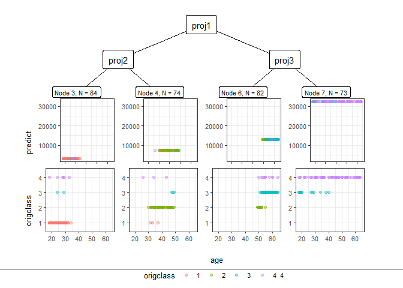
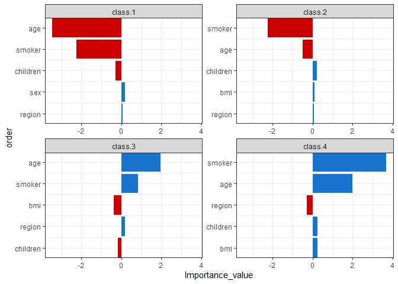
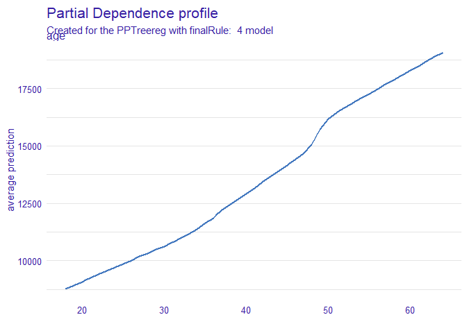

<!-- README.md is generated from README.Rmd. Please edit that file -->

# PPtreeregViz

<!-- badges: start -->
<!-- badges: end -->

The goal of PPtreeregViz is to …

## Installation

You can install the released version of PPtreeregViz from
[CRAN](https://CRAN.R-project.org) with:

이 패키지는 사영추적회귀 나무 기법을 모델링을 하고 이 모델을 시각적으로
해석하기 위한 기법들을 담고 있다.

``` r
install.packages("PPtreeregViz")
```

## Example

## 나무 만들기

``` r
library(PPtreeregViz)
library(dplyr)
#> 
#> 다음의 패키지를 부착합니다: 'dplyr'
#> The following objects are masked from 'package:stats':
#> 
#>     filter, lag
#> The following objects are masked from 'package:base':
#> 
#>     intersect, setdiff, setequal, union
library(ggplot2)

data("insurance")
set.seed(123)
proportion = 0.9
idx_train = sample(1:nrow(insurance), size = round(proportion * nrow(insurance)))
sample_train = insurance[idx_train, ]
sample_test =  insurance[-idx_train, ]
sample_one <- sample_test[sample(1:nrow(sample_test),1),-7]

model <- PPTreereg(charges~., data = sample_train, DEPTH = 2)

plot(model)
```


    #> NULL

``` r
pp_ggparty(model, "age")
```



## Variable Importance based on logic

``` r
Tree.Imp <- PPimportance(model) 
plot(Tree.Imp)
```



``` r
plot(Tree.Imp, marginal = TRUE)
#> Warning: `guides(<scale> = FALSE)` is deprecated. Please use `guides(<scale> =
#> "none")` instead.
```


``` r
PPregNodeViz(model,node.id = 4)
#> Warning: Removed 1 rows containing missing values (geom_point).
```


``` r
PPregNodeViz(model,node.id = 7)
#> Warning: Removed 1 rows containing missing values (geom_point).
```


``` r
PPregVarViz(model,"age")
#> `geom_smooth()` using method = 'loess' and formula 'y ~ x'
```


## Calculate SHAP for pptreereeg method

``` r
ppshapr.simple(model,sample_one,5)$dt
#>         none        age           sex           bmi children        smoker
#> 1:  2973.337   615.2921 -5.589641e-09 -5.589527e-09 713.4164 -5.589527e-09
#> 2:  7378.610 -3204.4418 -3.413311e-08 -3.413334e-08 193.4133 -3.413379e-08
#> 3: 13003.698 -8061.2492 -7.003462e-08 -7.003507e-08 284.6459 -9.250500e+02
#> 4: 32841.852 -1701.5829 -3.111571e-06  7.426464e+02 143.5394 -2.769929e+04
#>           region finalLeaf
#> 1: -5.589641e-09         1
#> 2: -6.553650e+01         2
#> 3: -7.003530e-08         3
#> 4: -2.512233e+01         4
```

``` r
waterfallplot(PPTreeregOBJ = model, testObs = sample_one, final.rule = 5, method="simple") 
#> Warning in `[.data.table`(tmp, , ..icols): Both 'icols' and '..icols' exist
#> in calling scope. Please remove the '..icols' variable in calling scope for
#> clarity.
#> Warning in `[.data.table`(tmp, , -..icols): Both 'icols' and '..icols' exist
#> in calling scope. Please remove the '..icols' variable in calling scope for
#> clarity.

#> Warning in `[.data.table`(tmp, , -..icols): Both 'icols' and '..icols' exist
#> in calling scope. Please remove the '..icols' variable in calling scope for
#> clarity.

#> Warning in `[.data.table`(tmp, , -..icols): Both 'icols' and '..icols' exist
#> in calling scope. Please remove the '..icols' variable in calling scope for
#> clarity.

#> Warning in `[.data.table`(tmp, , -..icols): Both 'icols' and '..icols' exist
#> in calling scope. Please remove the '..icols' variable in calling scope for
#> clarity.
```


``` r
decisionplot(PPTreeregOBJ = model, testObs = sample_one, final.rule = 5, method="simple",varImp = "shapImp" ) 
#> Warning in xtfrm.data.frame(x): cannot xtfrm data frames
```


## DALEX

This approach directly measures feature importance by observing how
random re-shuffling (thus preserving the distribution of the variable)
of each predictor influences model performance.

permutation importance overestimates the importance of correlated
predictors Strobl et al (2008)

``` r
library("DALEX")
new_explainer <- explain_PP(PPTreeregOBJ = model, data = sample_train[,-7], 
                            y = sample_train[,7], final.rule = 4)
#> Preparation of a new explainer is initiated
#>   -> model label       :  PPTreereg with finalRule:  4 
#>   -> data              :  313  rows  6  cols 
#>   -> target variable   :  313  values 
#>   -> predict function  :  function(m, x) as.numeric(predict.PPTreereg(m, x, final.rule = final.rule)) 
#>   -> predicted values  :  No value for predict function target column. (  default  )
#>   -> model_info        :  package Model of class: PPTreereg package unrecognized , ver. Unknown , task regression (  default  ) 
#>   -> predicted values  :  numerical, min =  1113.295 , mean =  13513.32 , max =  46298.96  
#>   -> residual function :  difference between y and yhat (  default  )
#>   -> residuals         :  numerical, min =  -12369.96 , mean =  575.5522 , max =  23489.04  
#>   A new explainer has been created! 
class(new_explainer)
#> [1] "explainer"
DALEX::model_performance(new_explainer)
#> Measures for:  regression
#> mse        : 28282790 
#> rmse       : 5318.157 
#> r2         : 0.8191769 
#> mad        : 224.7234
#> 
#> Residuals:
#>           0%          10%          20%          30%          40%          50% 
#> -12369.96245  -4141.99868   -553.59635   -126.02736    -63.50962    -20.61961 
#>          60%          70%          80%          90%         100% 
#>     42.12989    119.72145    546.84601   4913.08487  23489.03866
DALEX::model_performance(new_explainer) %>% plot()
```


``` r
DALEX::model_profile(new_explainer, variables = "age") %>% plot()
```



``` r
DALEX::model_profile(new_explainer, variables = "bmi") %>%
  plot(geom="profiles")
```


``` r
DALEX::predict_parts(new_explainer, new_observation = sample_one) %>% plot()
```


## submodularPick

``` r
PP_model <- caret::train(charges~.,data = sample_train,
                        method = PPTreereg.M1 ,
                        DEPTH=2,
                        PPmethod="LDA")
#> Warning: 패키지 'caret'는 R 버전 4.1.1에서 작성되었습니다
#> 필요한 패키지를 로딩중입니다: lattice
lime_explainer <- lime::lime(sample_train[,-7], PP_model)
#> Warning: sex does not contain enough variance to use quantile binning. Using
#> standard binning instead.
#> Warning: smoker does not contain enough variance to use quantile binning. Using
#> standard binning instead.
class1s_obs <- SubPick_PPTreereg(model, lime_explainer, "class1", 10) 
class1s_obs 
#>  [1] "96"  "227" "78"  "47"  "114" "51"  "170" "182" "36"  "295"
```
