<!-- README.md is generated from README.Rmd. Please edit that file -->

## PPtreeregViz

<!-- badges: start -->
<!-- badges: end -->

This package was developed to visualize the Projection Pursuit
Regression Tree model
<a href="https://www.mdpi.com/2076-3417/11/21/9885/pdf"></a> and add
explanatory possibilities of the model using XAI (eXplainable AI)
techniques. Since Pptreeregression is based on tree method and grows
using projection of input features, the model has excellent
interpretability itself. By visualizing each node of this model, global
analysis of the model is possible. (This method is model-specific
because it can only be used in the pptreereg model.) Global
interpretation using this method is possible, but it is difficult to
interpret one observation because it goes through several projections.
To overcome this, the developed XAI techniques were slightly modified to
fit the structure of pptreereg model. Using these visualization methods,
it is possible to figure out how and what features have affected the
model’s prediction. Through these processes, we can determine whether
the model is trustworthy or not.

## Installation

<a href='https://github.com/sunsmiling/PPtreeregViz'></a>

You can install the released version of PPtreeregViz from CRAN with:

``` r
devtools::install_github("PPtreeregViz")
```

And the development version from GitHub with:

``` r
# install.packages("devtools")
devtools::install_github("sunsmiling/PPtreeregViz")
```

## Example Data

As an example, Boston house price data from the MASS library was used.
In the first part, we will talk about visualizing model itself. Next, we
will see an example of explaining model by applying XAI techniques.

### Boston Data

The Boston data were divided into a train data set and a test data set
at a ratio of 7:3. In particular, the first observation in the test data
set was specifically selected as “sample_one”.

``` r
data("Boston")

set.seed(1234)
proportion = 0.7
idx_train = sample(1:nrow(Boston), size = round(proportion * nrow(Boston)))
sample_train = Boston[idx_train, ]
sample_test =  Boston[-idx_train, ]
sample_one <- sample_test[sample(1:nrow(sample_test),1),-14]
```

## Build Model & Plot Model itself

Create a PPTreereg model with Depth as 2 for ease of visualization and
interpretation.

``` r
library(PPtreeregViz)
Model <- PPtreeregViz::PPTreereg(medv ~., data = sample_train, DEPTH = 2)
```

``` r
plot(Model)
```

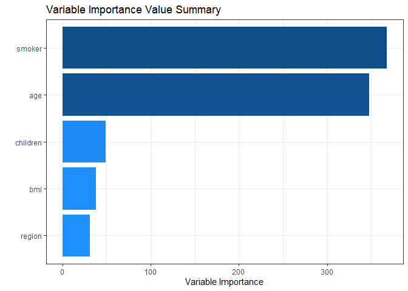

    #> NULL

Through `pp_ggparty`, marginal predicted values and actual values are
drawn according to independent variables for each final node. In the
group with the lower 25% of house prices, lstat(lower status of the
population (percent)) had a wide range from 10 to 30, but in the group
with the top 25%, lstat had only values less than 15.

``` r
pp_ggparty(Model, "lstat", final.rule = 1)
```

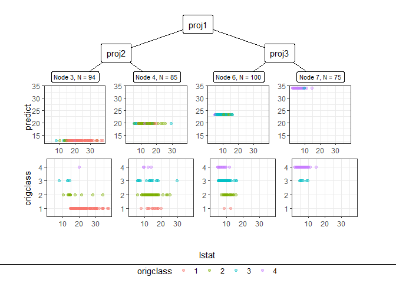

``` r
pp_ggparty(Model, "lstat", final.rule = 4)
```

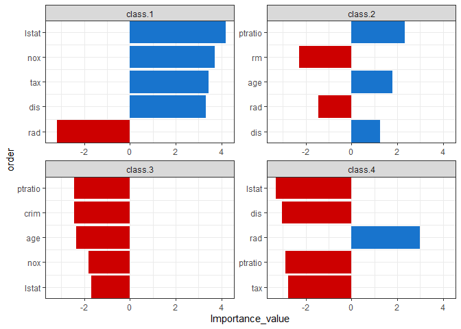

``` r
pp_ggparty(Model, "lstat", final.rule = 5)
```

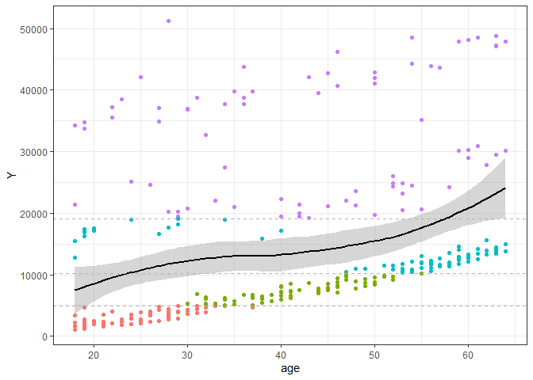 \###
variable importance plot

By using the combination of the regression coefficient values of the
projection values at each split node, the importance of the variables
for which the model was built can be calculated. `PPimportance`
calculate split node’s coefficients and can be drawn for each final
leaf. The blue bar represents the positive slope (effect), and the red
bar represents the negative slope.

Variables are sorted according to the overall size of each bar, so you
can know the variables that are considered important for each final node
sequentially.

``` r
Tree.Imp <- PPimportance(Model) 
plot(Tree.Imp)
```


If you use some arguments such as `marginal = TRUE` and `num_var`, you
can see the desired number of marginal variable importance of the whole
rather than each final leaf.

``` r
plot(Tree.Imp, marginal = TRUE, num_var = 5)
#> Warning: `guides(<scale> = FALSE)` is deprecated. Please use `guides(<scale> =
#> "none")` instead.
```

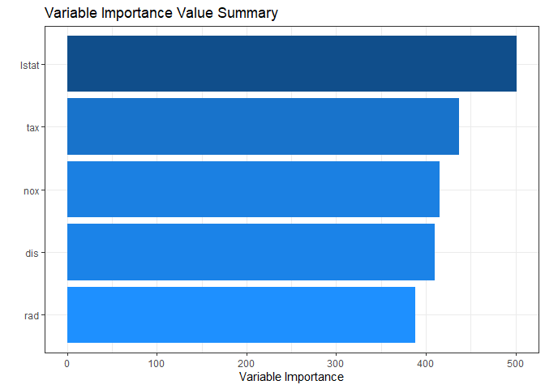

### Node visualization

`PPregNodeViz` can visualize how train data is fitted for each node.
When the node.id is 4 (i.e. first final node), the result of fitted data
is displayed in black color. In order to improve accuracy, PPTreereg can
choose the final.rule from 1 to 5, whether to use a single value or a
linear combination of independent variables.

``` r
PPregNodeViz(Model, node.id = 1)
```


``` r
PPregNodeViz(Model, node.id = 4)
#> Warning: Removed 2 rows containing missing values (geom_point).
```

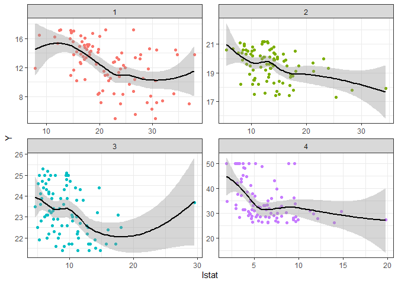

4th final leaf’s node id is 7.

``` r
PPregNodeViz(Model,node.id = 7)
#> Warning: Removed 2 rows containing missing values (geom_point).
```

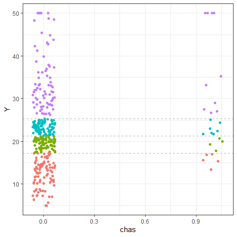

### Variable visualization

Using `PPregvarViz` shows results similar to partial dependent plots of
how independent variable affects the prediction of Y in actual data. If
the argument `Indiv=TRUE`, the picture is drawn by dividing the grid for
each final node.

``` r
PPregVarViz(Model,"lstat")
#> `geom_smooth()` using method = 'loess' and formula 'y ~ x'
```

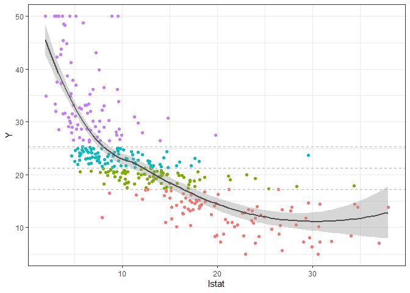

``` r
PPregVarViz(Model,"lstat",indiv = TRUE)
#> `geom_smooth()` using method = 'loess' and formula 'y ~ x'
```

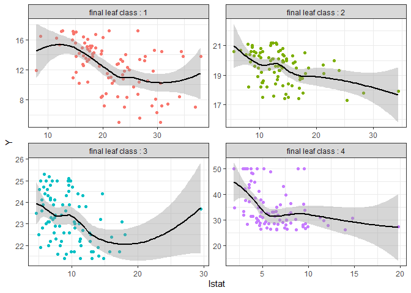

## Using XAI method

### Calculate SHAP for PPTreereg method

So far, we have only seen the global movement of the model itself. From
now on, we will proceed with model analysis using SHAP values. Using the
SHAP value, you can see locally how one sample data moves in the model.
In order to calculate the SHAP value more faster, the method for
calculating the kernel shap of the
[‘NorskRegnesentral/shapr’](https://github.com/NorskRegnesentral/shapr)
package was slightly modified and used.

``` r
sample_one
#>        crim zn indus chas  nox   rm  age    dis rad tax ptratio  black lstat
#> 177 0.07022  0  4.05    0 0.51 6.02 47.2 3.5549   5 296    16.6 393.23 10.11
```

Since the `empiriacl` method, which is a more accurate calculation
method, takes more time to calculate, a `simple` calculation method,
which is an estimate of this value, was used.

``` r
ppshapr.simple(PPTreeregOBJ = Model, testObs = sample_one, final.rule = 5)$dt
#>        none         crim           zn       indus        chas           nox
#> 1: 23.25114 -0.008369025 -0.007357408 0.009685125 -0.00178154 -0.0002517925
#>              rm        age        dis          rad         tax     ptratio
#> 1: -0.008369025 0.06894799 0.04018246 -0.006113893 0.009685125 0.009685125
#>           black       lstat finalLeaf
#> 1: -0.003396076 -0.04969885         3
```

Although the difference in calculation speed between ppshapr.simple and
ppshapr.empircal is quite large, it can be seen that the results are
similar.

### Decision plot

PPTreereg creates a tree based on the range of y values. Therefore, when
calculating the contributions of features of one observation, it is
natural that different values are calculated for each final leaf.
Compared with the data with y value in the lower 25% (first final leaf),
the effect of lstat of \[`sample_one`\] was very large. On the other
hand, it can be seen that the influence of rm (average number of rooms
per dwelling) is very large in data with upper 25% large y value (4th
final leaf). How each feature affects yhat in one observation can be
drawn in two ways. `decisionplot` and `waterfallplot`.

``` r
decisionplot(Model, testObs = sample_one, method="simple",varImp = "shapImp",final.rule=5)
```

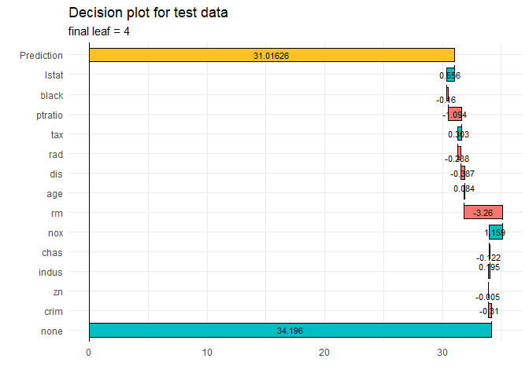

``` r
waterfallplot(Model, testObs = sample_one, method="simple", final.rule=4)
```

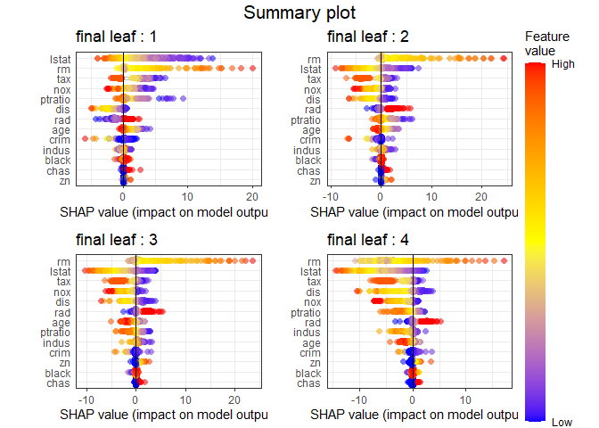

### Summary & Dependence plot

We would like to see how the entire SHAP values of train data move in
the model, not the effect of one observation. Since this could be quiet
computationally expensive, so it is calculated at once using
`ppshapr_prep`.

``` r
shap_long <- ppshapr_prep(Model, final.rule = 5, method = "simple") #takes about 4 minutes
```

The summary plot visualizes how the overall features of the training
data affect the SHAP distribution. For each final leaf, a red dot means
that the feature value corresponding to that point has a high value. The
yellow color means the middle value of the feature value, and the blue
color has a lower feature value. For each leaf, features are sorted in
descending order of the SHAP’s variance. In all final leaves, rm, lstat,
and tax had a great influence in determining the house price in common.

``` r
PPshapsummary(data_long = shap_long)
```

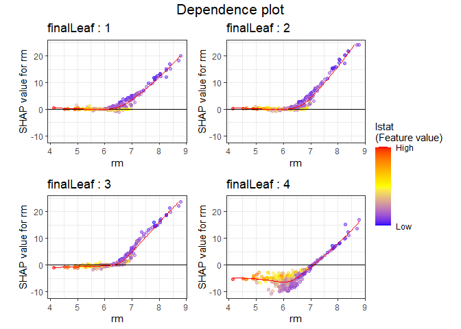

Through the dependency plot, for each final leaf, the effect of the
number of rooms on the house price can be seen. When the number of rooms
was 6 or less, the number of rooms did not have a significant effect on
the house price in the low house price (1st final leaf), but the SHAP
value had a negative value as the number of rooms decreased in the data
corresponding to the top 25% of the house price. In other words, it can
be interpreted that in an area with a low house price, when the number
of rooms was small or average, it did not affect house price, but in an
area with a high house price, a small number of rooms had a negative
effect on the house price.

``` r
PPshapdependence(shap_long,x = "rm")
#> Warning: Removed 1 rows containing missing values (geom_point).
#> Warning: Removed 4 rows containing missing values (geom_smooth).
```

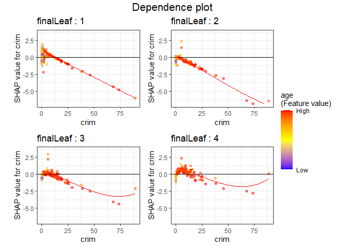

You can add color to see how it relates to other feature. As a result of
specifying lstat as a color, it can be seen that the lower the lstat and
the larger the number of rooms, SHAP values increase.

``` r
PPshapdependence(shap_long,x = "rm", color_feature = "lstat")
#> Warning: Removed 4 rows containing missing values (geom_smooth).
```

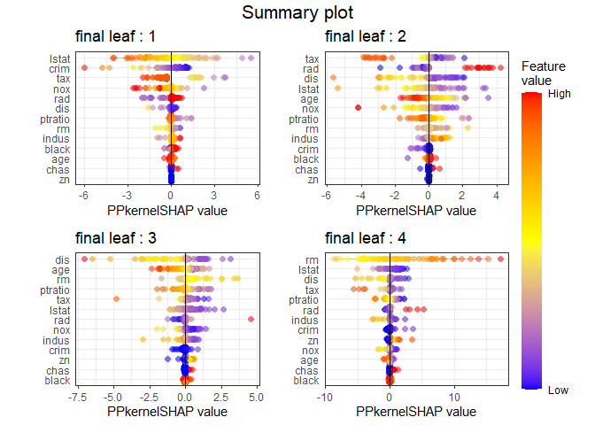

Next, as a result of examining crim and age, the higher crim contributed
to the lower house price.

``` r
PPshapdependence(shap_long,x = "crim", color_feature = "age")
#> Warning: Removed 1 rows containing missing values (geom_point).
```

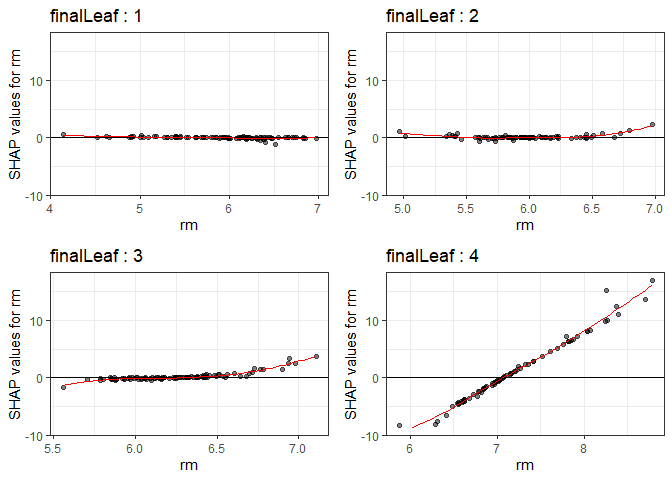

### Collaboration with other packages

It can be collaborate with various XAI-related packages that have
already been developed (DALEX and lime). If you use these package, you
cannot see the characteristics of each final node, but you can see the
results of the entire model. The following shows an example using the
functions in the DALEX package.

#### DALEX

``` r
library("DALEX")
#> Welcome to DALEX (version: 2.4.2).
#> Find examples and detailed introduction at: http://ema.drwhy.ai/
#> 
#> 다음의 패키지를 부착합니다: 'DALEX'
#> The following object is masked from 'package:dplyr':
#> 
#>     explain
new_explainer <- explain_PP(PPTreeregOBJ = Model, data = sample_train[,-14], 
                            y = sample_train[,14], final.rule = 4)
#> Preparation of a new explainer is initiated
#>   -> model label       :  PPTreereg with finalRule:  4 
#>   -> data              :  354  rows  13  cols 
#>   -> target variable   :  354  values 
#>   -> predict function  :  function(m, x) as.numeric(predict.PPTreereg(m, x, final.rule = final.rule)) 
#>   -> predicted values  :  No value for predict function target column. (  default  )
#>   -> model_info        :  package Model of class: PPTreereg package unrecognized , ver. Unknown , task regression (  default  ) 
#>   -> predicted values  :  numerical, min =  6.23836 , mean =  22.16265 , max =  50.86801  
#>   -> residual function :  difference between y and yhat (  default  )
#>   -> residuals         :  numerical, min =  -22.9165 , mean =  0.2167251 , max =  29.68961  
#>   A new explainer has been created!
```

``` r
DALEX::model_performance(new_explainer)
#> Measures for:  regression
#> mse        : 16.23654 
#> rmse       : 4.029459 
#> r2         : 0.8056848 
#> mad        : 1.566196
#> 
#> Residuals:
#>           0%          10%          20%          30%          40%          50% 
#> -22.91649613  -3.46075535  -2.01332404  -1.09793019  -0.59868895  -0.09435965 
#>          60%          70%          80%          90%         100% 
#>   0.57727933   1.21600562   2.26041174   4.14090308  29.68961335
```

``` r
DALEX::model_performance(new_explainer) %>% plot()
```

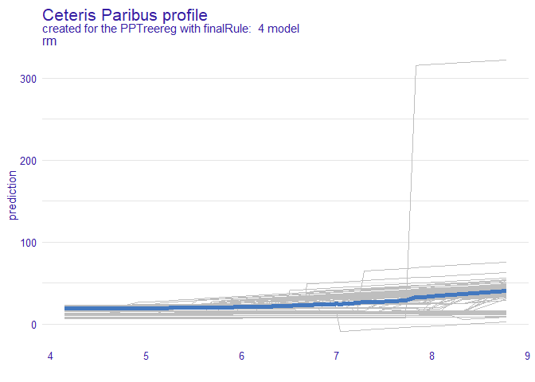

``` r
DALEX::model_profile(new_explainer, variables = "rm") %>% plot()
```


``` r
DALEX::model_profile(new_explainer, variables = "rm") %>%
  plot(geom="profiles")
```


``` r
DALEX::predict_parts(new_explainer, new_observation = sample_one) %>% plot()
```

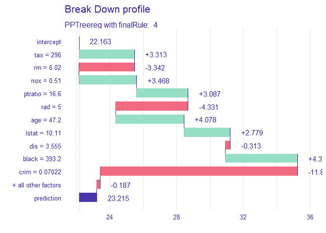

#### lime package

``` r
PP_model <- caret::train(medv ~., data = sample_train,
                         method = PPTreereg.M1 ,
                         DEPTH=2,
                         PPmethod="LDA")
#> 필요한 패키지를 로딩중입니다: lattice

lime_explainer <- lime::lime(sample_train[,-14], PP_model)
#> Warning: chas does not contain enough variance to use quantile binning. Using
#> standard binning instead.
```

In order to check whether the created model works well, it is important
to apply it to multiple instances. We implemented the Submodular Pick
algorithm in \[‘LIME’\]<a href="https://arxiv.org/abs/1602.04938"></a> ,
which presented the methodology for which instance to choose. It was
possible to extract 10 data from the data set whose final leaf is 1.

### submodularPick

``` r
class1s_obs <- SubPick_PPTreereg(Model, lime_explainer, "class1", obsnum = 10) 
class1s_obs 
#> $df
#>         crim zn indus chas   nox    rm   age    dis rad tax ptratio  black
#> 415 45.74610  0  18.1    0 0.693 4.519 100.0 1.6582  24 666    20.2  88.27
#> 381 88.97620  0  18.1    0 0.671 6.968  91.9 1.4165  24 666    20.2 396.90
#> 390  8.15174  0  18.1    0 0.700 5.390  98.9 1.7281  24 666    20.2 396.90
#> 393 11.57790  0  18.1    0 0.700 5.036  97.0 1.7700  24 666    20.2 396.90
#> 455  9.51363  0  18.1    0 0.713 6.728  94.1 2.4961  24 666    20.2   6.68
#> 440  9.39063  0  18.1    0 0.740 5.627  93.9 1.8172  24 666    20.2 396.90
#> 406 67.92080  0  18.1    0 0.693 5.683 100.0 1.4254  24 666    20.2 384.97
#> 452  5.44114  0  18.1    0 0.713 6.655  98.2 2.3552  24 666    20.2 355.29
#> 432 10.06230  0  18.1    0 0.584 6.833  94.3 2.0882  24 666    20.2  81.33
#> 426 15.86030  0  18.1    0 0.679 5.896  95.4 1.9096  24 666    20.2   7.68
#>     lstat
#> 415 36.98
#> 381 17.21
#> 390 20.85
#> 393 25.68
#> 455 18.71
#> 440 22.88
#> 406 22.98
#> 452 17.73
#> 432 19.69
#> 426 24.39
#> 
#> $obs
#>  [1] "415" "381" "390" "393" "455" "440" "406" "452" "432" "426"
```

``` r
decisionplot(Model, testObs = class1s_obs$df , method="simple",varImp = "shapImp",final.rule=5)
```

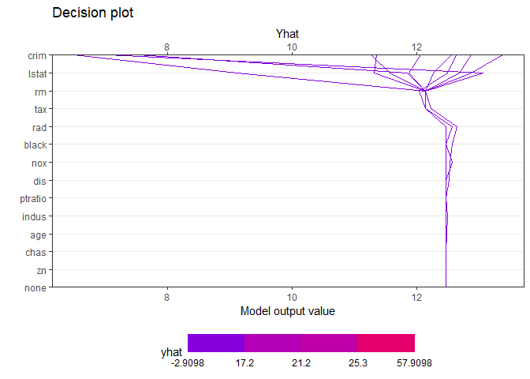
